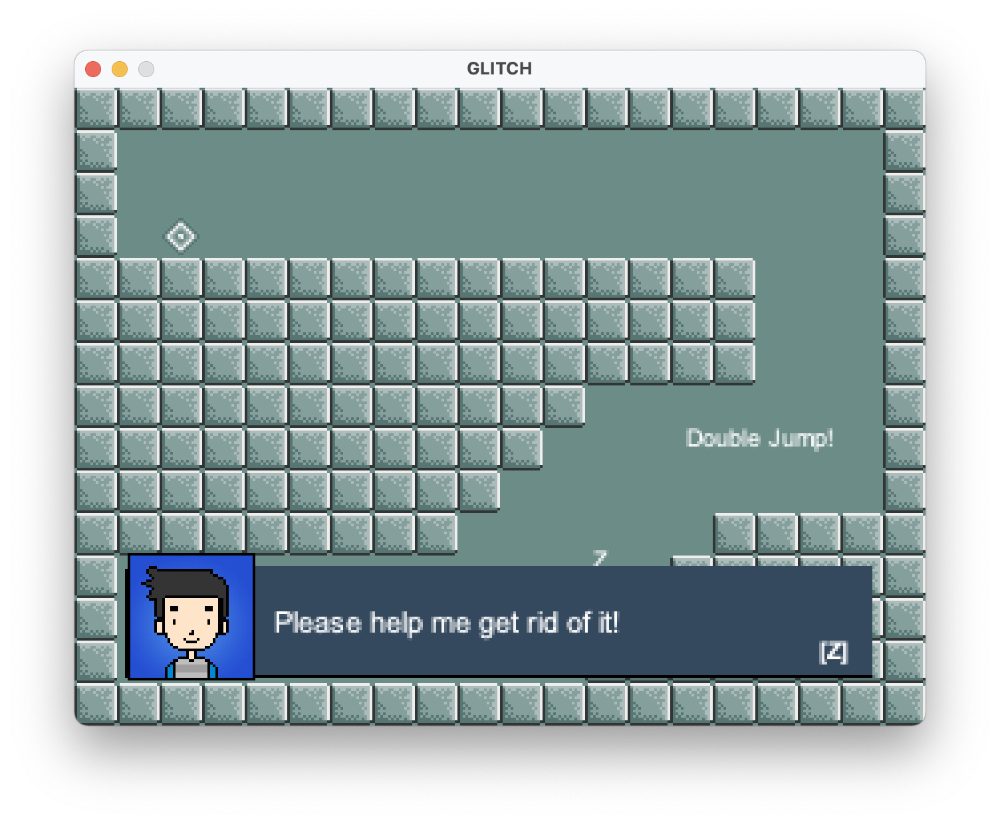
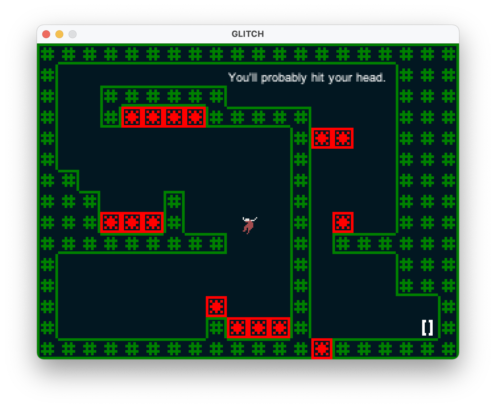
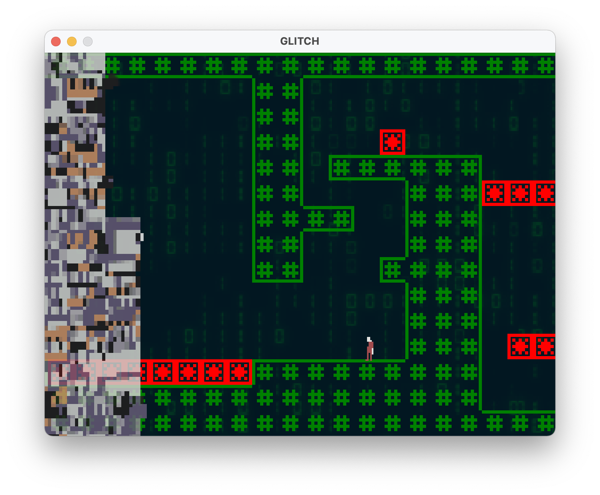

 

GLITCH is a puzzle platformer designed to challenge your memory, patience, and platforming skills!

## Download
|    Windows  |            Mac          |           Linux         |
|:---------:|:---------------------:|:---------------------:|
| [Download](https://github.com/0kzh/glitch/releases/tag/1.0) | [Download](https://github.com/0kzh/glitch/releases/tag/1.0) | [Download](https://github.com/0kzh/glitch/releases/tag/1.0) |
## Screenshots

